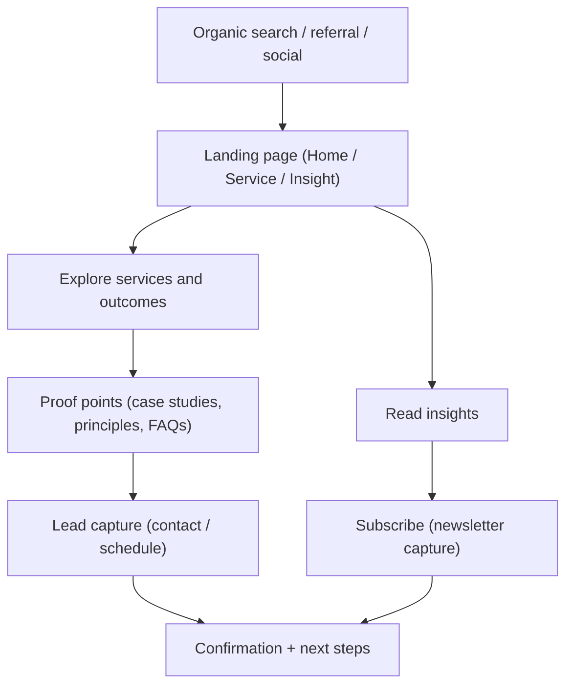

## 1. Product Overview
A modern corporate website for a data enablement, analytics, transformation, and AI enablement consulting firm. The site establishes credibility, clearly communicates offerings, and converts high-intent visitors into qualified leads.
- Primary goals: communicate expertise, create clear paths to services, capture leads, support discovery via SEO, and meet WCAG 2.1 AA accessibility requirements
- Target users: CTO/CIO/CDO, Heads of Data/Analytics, Product Leaders, Operations Leaders, Procurement, and transformation program sponsors
- Value proposition: practical, outcome-driven data and AI transformation with measurable impact, modern delivery practices, and enterprise-grade governance

## 2. Core Features

### 2.1 User Roles (if applicable)
Not required. Content is public; primary conversion actions are lead submissions and content subscription.

### 2.2 Feature Module
1. **Home**: value proposition, service entry points, proof points, outcomes, featured insights, multiple CTAs
2. **Services**: clear service taxonomy, packages/engagement models, deliverables, outcomes, FAQs, CTAs
3. **Service Detail (template)**: one page per service (indexable), deep content, proof points, CTAs
4. **Industries / Use Cases**: tailored narratives and outcomes for key industries, CTA blocks
5. **Case Studies**: results-driven stories, metrics, challenge/approach/outcome structure, CTAs
6. **Insights**: articles, guides, and thought leadership; supports SEO and authority building
7. **Insight Detail**: long-form content template optimized for SEO/AEO and readability
8. **About**: credibility, leadership, operating principles, delivery approach, partners
9. **Contact**: high-conversion lead form, scheduling CTA, office/location details, alternate channels
10. **Legal**: privacy policy + accessibility statement

### 2.3 Page Details
| Page Name | Module Name | Feature description |
|-----------|-------------|---------------------|
| Home | Hero + primary CTA | High-clarity headline and subhead; primary CTA to contact/schedule; supporting CTA to services |
| Home | Proof + logos | Trust indicators, certifications, client logos (if available), security/privacy commitments |
| Home | Service cards | Clear service categories with outcomes; links to service detail pages |
| Home | Outcomes metrics | Quantified impact blocks (e.g., “Cycle time ↓”, “Forecast accuracy ↑”) with supporting copy |
| Home | Lead capture | Inline form section + sticky CTA; minimal fields; accessible validation |
| Services | Service taxonomy | Grouped offerings: Data Enablement, Analytics, Transformation, AI Enablement |
| Services | Engagement models | Fixed-scope discovery, delivery sprints, retained advisory, build-operate-transfer |
| Services | FAQ + objections | Procurement/security, timelines, “build vs buy”, data privacy, model governance |
| Service Detail | SEO + AEO content | Deep content with headings, FAQs, definitions, “how we do it” steps, internal links |
| Industries | Tailored pages | Industry-specific pain points, applicable services, case studies, CTAs |
| Case Studies | Results format | Problem → approach → delivery → outcomes; structured metrics; related services |
| Insights | Listing + filters | Topic taxonomy, search, featured resources; internal links to services |
| Insight Detail | Readability | TOC, reading time, author/date, related posts, citations, strong heading hierarchy |
| About | Team + principles | Differentiated narrative; process; governance/quality; hiring CTA optional |
| Contact | Lead form | Name, work email, company, role, topic, message; consent checkbox; honeypot; rate limit |
| Legal | Privacy policy | Plain-language privacy, cookie policy (if applicable), contact for privacy requests |
| Legal | Accessibility statement | Compliance status, known issues, contact for help, continuous improvement note |

## 3. Core Process
- Visitor lands on SEO entry (service detail, industry page, or insight)
- Visitor navigates to relevant service and scans outcomes, deliverables, credibility, FAQs
- Visitor converts via “Book a consult” or “Request a proposal” (lead form)
- Visitor optionally subscribes to insights (newsletter capture)

## 4. User Interface Design

### 4.1 Design Style
- Concept direction: “Precision + momentum” — editorial layout, restrained palette, sharp hierarchy, subtle motion, data-inspired textures (grids/noise/lines) used sparingly
- Primary colors: near-black background + warm off-white text; accent in electric teal + signal orange for CTAs
- Typography: distinctive display serif for headlines + technical sans for body; large, confident headline scale; comfortable line-length for long-form content
- Layout: desktop-first, generous spacing, strong vertical rhythm; content grid with occasional “grid-break” hero composition
- Components: pill navigation, crisp cards with hairline borders, high-contrast CTA buttons, accessible focus rings, subtle hover states
- Motion: staggered reveals for key sections; reduced motion support; micro-interactions on CTAs and navigation

### 4.2 Page Design Overview
| Page Name | Module Name | UI Elements |
|-----------|-------------|-------------|
| Home | Hero | Split layout (headline + “data lines” visual); primary CTA; secondary CTA; animated but subtle |
| Home | Services | Card grid; iconography; outcome-first copy; “Learn more” links |
| Services | Packages | Side-by-side comparison table; sticky CTA; FAQ accordion |
| Service Detail | AEO blocks | Definition callouts; “How it works” steps; FAQ; related case studies |
| Insights | Listing | Filter chips; search; featured post; accessible pagination |
| Insight Detail | Reading UX | TOC, pull quotes, code/diagram blocks, strong headings, related content |
| Contact | Form | Single-column, large touch targets, clear validation, success state, minimal friction |

### 4.3 Responsiveness
- Desktop-first layout with progressive enhancement to tablet/mobile
- Mobile: single column; CTA stays visible via bottom bar; sticky section headers avoided for screen readers
- Touch: 44px targets, spacing between interactive elements, hover-dependent interactions avoided
- Images: responsive `srcset` where applicable; critical imagery prioritized; lazy-load non-critical media

### 4.4 Accessibility (WCAG 2.1 AA)
- Semantic HTML and landmarks (header/nav/main/footer), correct heading order, descriptive link text
- Keyboard-first navigation (visible focus, skip-to-content, no focus traps)
- Color contrast: meet AA (and aim AAA for body text where practical)
- Reduced motion support (`prefers-reduced-motion`), avoids parallax for essential content
- Forms: explicit labels, error summaries, programmatic validation messages, field instructions
- Images: meaningful `alt` text; decorative images use empty alt; no text embedded in images

### 4.5 SEO + AEO (Accessibility Optimization)
- SEO: page titles, canonical URLs, meta descriptions, Open Graph/Twitter cards, sitemap, robots, performant font loading
- Structured data: `Organization`, `WebSite`, `BreadcrumbList`, `Service`, `Article`, `FAQPage` where relevant
- AEO: accessible headings, clear summaries, definitional blocks, FAQs with concise answers, table of contents for long-form
- Performance: target Core Web Vitals (LCP, CLS, INP) via image optimization, code splitting, preloading critical assets
