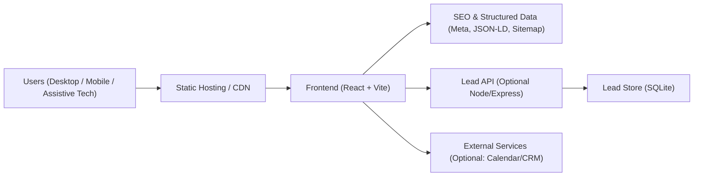
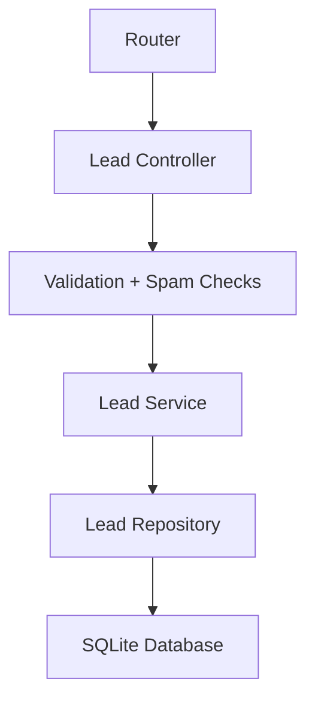
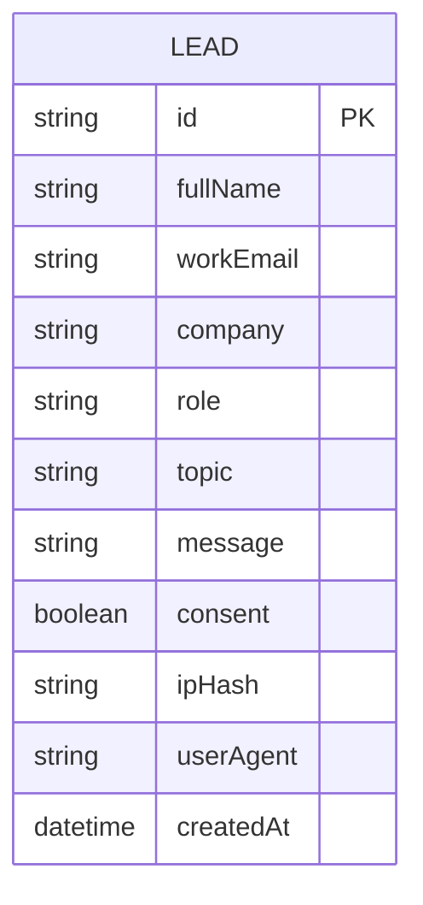

## 1. Architecture Design
Frontend-first architecture optimized for performance, SEO, and accessibility, with an optional lightweight backend API for lead capture that can be replaced by a CRM/form provider later without redesigning the UI.



## 2. Technology Description
- Frontend: React@18 + TypeScript + tailwindcss@3 + vite
- Routing: react-router (SPA) + prerender/static generation strategy (implementation decision: Vite SSG-style prerender)
- Styling: Tailwind for primitives + lightweight component styling conventions; use CSS variables for theme tokens
- Content: MD/MDX for Insights and case studies (build-time rendering for SEO)
- Accessibility: eslint + automated checks (axe) in tests; keyboard and reduced-motion support in components
- Backend (optional but recommended for “working out-of-the-box” lead capture): Node.js + Express
- Database (backend option): SQLite (local file) for lead persistence in dev/demo; production can swap to Postgres

## 3. Route Definitions
| Route | Purpose |
|-------|---------|
| / | Home landing page |
| /services | Service overview and engagement models |
| /services/:slug | Service detail (SEO landing page per service) |
| /industries | Industry overview |
| /industries/:slug | Industry detail |
| /case-studies | Case study listing |
| /case-studies/:slug | Case study detail |
| /insights | Insight listing |
| /insights/:slug | Insight detail (article template) |
| /about | Company story, team, operating principles |
| /contact | Lead capture form + scheduling CTA |
| /privacy | Privacy policy |
| /accessibility | Accessibility statement |

## 4. API Definitions (if backend exists)

### 4.1 Lead Capture
**POST /api/leads**
- Purpose: submit a lead inquiry from the site
- Security: rate limit by IP, honeypot field, server-side validation, CORS restricted to site origin

TypeScript schema (conceptual):
```ts
export type LeadTopic =
  | "data-enablement"
  | "analytics"
  | "transformation"
  | "ai-enablement"
  | "governance"
  | "other";

export interface CreateLeadRequest {
  fullName: string;
  workEmail: string;
  company: string;
  role?: string;
  topic: LeadTopic;
  message: string;
  consent: boolean;
  website?: string;
}

export interface CreateLeadResponse {
  id: string;
  receivedAt: string;
}
```

**GET /api/health**
- Purpose: environment readiness and uptime checks for the optional API

## 5. Server Architecture Diagram (if backend exists)


## 6. Data Model (if applicable)

### 6.1 Data Model Definition


### 6.2 Data Definition Language
```sql
CREATE TABLE IF NOT EXISTS leads (
  id TEXT PRIMARY KEY,
  full_name TEXT NOT NULL,
  work_email TEXT NOT NULL,
  company TEXT NOT NULL,
  role TEXT,
  topic TEXT NOT NULL,
  message TEXT NOT NULL,
  consent INTEGER NOT NULL CHECK (consent IN (0, 1)),
  ip_hash TEXT,
  user_agent TEXT,
  created_at TEXT NOT NULL
);

CREATE INDEX IF NOT EXISTS idx_leads_created_at ON leads(created_at);
CREATE INDEX IF NOT EXISTS idx_leads_topic ON leads(topic);
```
